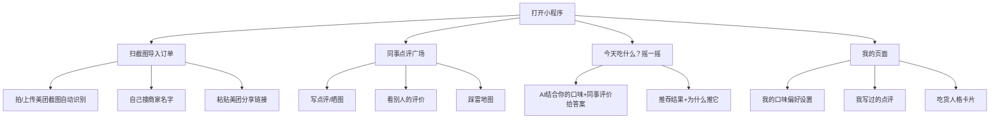

# 公司外卖点评小程序 — 需求文档

## 这个东西是干嘛的

**产品名称：外卖服刑录**

"服刑"就是在受苦，点了难吃的外卖就是在服刑，同事互相记录彼此受的苦，帮后人少坐牢。

**一句话解释：** 同事点了外卖觉得好吃或者难吃，来这里说一声，下次你点的时候就不用瞎猜了。顺带一个AI帮你解决"今天吃什么"的烦恼。

**谁在用：** 仅限公司内部同事，通过公司专属邀请码进来，外人进不来，保证评价真实可信

---

## 一、整体结构




---

## 二、每个功能说清楚

### 2.1 怎么快速把订单导进来

**这个环节最重要。** 如果录个订单要花3分钟，没人愿意用。所以必须做到10秒搞定。

**方式一：截图上传（首推）**

- 你在美团下完单或者收到外卖，截个图，上传进来
- 系统自动帮你认出：哪家店、点了什么菜、花了多少钱
- 你看一眼确认没问题，点确认就完事了
- 好处：不用装任何其他软件，截图是大家都会干的事

**方式二：粘贴美团分享链接**

- 美团订单页面有个"分享"按钮，复制那个链接粘进来
- 系统解析链接，自动填好信息
- 比截图更准，但不是所有人都知道怎么找那个分享按钮

**方式三：自己搜商家名字**

- 最笨但最稳的办法，就是自己打字搜一下商家
- 适合实在懒得截图的场景，兜底用

**确认方案：截图OCR为主路径，手动搜索兜底，粘贴链接暂不做**

主路径就是截图识别，上传截图 → 腾讯云OCR解析 → 确认信息 → 完成，10秒内搞定。识别失败才退回到手动搜商家名字。

---

### 2.2 点评怎么写

**写评价这个动作要快，最好30秒写完**

写评价的时候能填什么：

- 总体几颗星（1到5颗，点一下就行）
- 细分打分（可以不填）：好不好吃 / 份量够不够 / 包装严不严实 / 送得快不快
- 说几句话（必须写，至少10个字，不然没参考价值）
- 拍照上传（最多6张，强烈推荐晒图，一图胜千言）
- 贴标签：「踩雷」「强烈推荐」「性价比超高」「份量很足」「难吃到哭」「好吃到哭」「包装炸了」「送太慢了」等等，点一下就选上了

**大家写的评价在哪看：**

- 刷信息流，按最新 / 人气最高 / 差评最多 来排
- 点某个商家名字，能看这家店所有同事的历史评价
- 快速筛：本周踩雷 / 本周力荐 / 最新出炉
- 每条评价都显示是哪个同事写的，比看陌生人的评价更靠谱

**踩雷地图长什么样：**

- 以公司为中心，地图上能看到附近所有出现过的外卖店
- 踩雷的店标红色炸弹，好评多的标绿色笑脸，没人评过的是灰色
- 扫一眼地图，哪些地方是"雷区"一目了然

---

### 2.3 告诉系统你喜欢吃什么

**第一次进来的时候选一下，以后AI才能给你推对的东西**

选的内容分几类：

- 能不能吃辣：完全不吃辣 / 稍微辣一点 / 越辣越好 / 清淡为主
- 不吃什么：纯素食 / 清真 / 不吃海鲜 / 不吃香菜 / 不吃葱 / 不吃蒜
- 喜欢哪类：快餐盖饭 / 日料 / 中式炒菜 / 烧烤 / 粉面 / 汉堡炸鸡
- 能接受的价位：25块以内 / 25到50 / 无所谓

**用着用着系统会自动学：**

- 你老给辣的评差评，系统就记住你不能吃辣
- 你手动改也行，随时可以在"我的"里面改

---

### 2.4 摇一摇：今天吃什么

**最好玩的功能。解决每天最烦的"吃什么"这个问题**

**怎么玩：**

- 首页中间一个大骰子，点一下（或者摇手机）开始滚
- 动画跑几秒，停下来，给你一个答案

**给出来的是什么：**

- 这家店叫什么、店的封面图
- AI写的推荐理由，用大白话说，有点像朋友给你安利：
  > "推你去「老李黄焖鸡」！上周小王说份量巨大，吃完撑了一下午。你不能吃辣的话他家有番茄锅底，特别适合你。最近一周3个同事去了都没骂街，放心点！"
- 结构化的小标签：✅ 符合你口味  ✅ 同事最近评价都不错  ⚠️ 有人反映送得有点慢
- 两个按钮：「再摇一次」 或 「就吃这家」（点了就帮你直接进入评价录入准备）

**AI怎么算出来的（不用理解，但可以知道）：**

- 综合：你的口味偏好 + 这家店同事打的总分 + 大家评价里说了什么 + 现在几点（午饭/晚饭段） + 天气（下雨天配送慢的降权）
- 最近两周被差评超过2次的店，概率降低
- 太久没出现的好店，适当提高出现概率，让你尝个鲜

**确认方案：接入大模型API生成推荐语**
推荐逻辑（过滤+排序）用规则引擎控制，最终那段"为什么推它"的自然语言由大模型生成，让推荐语读起来有温度、像朋友说话而不是机器输出。候选模型：文心一言 / 豆包 / DeepSeek（成本较低）。

---

## 三、有趣的扩展玩法

### 3.1 踩雷预警推送

每天11:30给你发个提醒：「⚠️ 预警：XXX麻辣烫今天上午刚被2个同事吐槽，今天可以避开它」，帮你提前规避雷。

### 3.2 办公室吃货人格（升级为核心功能）

根据你点过什么、评过什么、喜欢踩雷还是发现宝藏，给你贴个"吃货人格"标签，像是：

- **「无辣不欢型」** — 给辣的菜打分永远偏高，你的身体是辣椒做的
- **「性价比猎人」** — 25块以内必须吃饱，一分钱一分货是你的人生信条
- **「专业踩雷选手」** — 别人没踩过的店你总是第一个中招，感谢你的牺牲
- **「什么都好吃」** — 五星常客，给每家都打满分，人间至宝
- **「吃货侦探」** — 评价字数最多，连包装有没有漏汁都要写进去
- **「佛系选手」** — 很少写评价，但一旦写了，肯定是踩了大雷
- **「尝鲜达人」** — 总是去没人评过的新店，吃货界的探险家
- **「老饕」** — 同一家店回头10次以上，认准了就不变心

人格卡片可以分享到朋友圈 / 公司群，不用说话就能引发讨论。每个季度更新一次人格，看看自己的口味有没有变化。

### 3.3 月度榜单（升级为核心功能）

**每月1号自动生成上个月的战绩，可以发群里：**

- **本月踩雷TOP3** — 被差评最多的三家店，附上经典差评金句
- **本月神仙外卖TOP5** — 好评率最高的，理由是什么一起附上
- **本月最敬业评论员** — 写评价最多最详细的同事，颁个小勋章
- **本月最惨踩雷人** — 运气最差的同事，开玩笑地"嘲讽"一下（要友好）
- **本月人均消费** — 全公司每人每天外卖花了多少，顺便算算一个月花了多少

榜单生成图片，一键分享，天然传播。

### 3.4 凑一单功能

摇完骰子决定吃哪家，点「叫上同事一起」，小程序直接生成一个"拼单接龙"，
发到群里，大家在里面点自己想要的菜，再也不用在群里发"我要一个×× / 我要一个××"。

### 3.5 外卖盲盒

不想摇骰子，想要惊喜？点「今天来个盲盒」，完全随机给你推一家**从来没人点过的高分店**，鼓励大家打开新世界的大门。

### 3.6 "报仇模式"（纯好玩）

给某家店打了差评之后，过了一段时间系统问你：「上次你觉得XXX难吃，要不要再给它一次机会，看它有没有进步？」点「要」的话系统提醒你下次可以考虑再试。二次评价会显示"二刷评价"标记，别人看到觉得有趣的同时也更有参考价值。

### 3.7 心情标签（轻量）

写评价时可以附加当天的"就餐心情"：「加班的一天靠它续命 」「开心的时候吃起来更香」「边开会边吃根本没心思品味」——这些心情数据积累多了，说不定能算出什么时候大家最容易给差评（周五下午最挑剔？）

### 3.8 换个说法推荐（对话式）

除了摇骰子，首页还可以有个输入框，打字告诉AI：「今天有点累，想吃软一点的」「今天预算只有20块」「上次那家太辣了换一个」，AI理解你说的话，给出对应推荐。

### 3.9 商家黑名单投票

如果某家店被连续踩雷，系统发起一个全员投票：「是否把XXX拉入黑名单，不再推荐？」，超过一半人投票同意就永久不出现在摇骰子里。感觉像在公司民主审判一家外卖店，参与感拉满。

### 3.10 本周吃了什么总结

每周日系统帮你统计一下：这周点了几次外卖、花了多少、吃了几次辣、有没有同一家店重复点……不是要教育你，就是让你对自己的饮食有点数，图文形式，可以分享。

---

## 四、技术选型（已确认）

**整体方向：全程跑在微信云开发上，不需要自己维护服务器**

- **小程序框架：** 微信小程序原生（配合云开发最省事，后续也可以迁Taro）
- **后端/云函数：** 微信云开发 Cloud Functions（Node.js运行时），按需触发，不用管服务器
- **数据库：** 云开发 CloudDB（内置MongoDB风格，免运维）+ 云存储放图片
- **截图识别：** 腾讯云OCR，在云函数里调用，和微信云开发同属腾讯体系，对接最简单，有每月免费额度
- **AI推荐语生成：** 大模型API（优先 DeepSeek，成本低；备选文心/豆包）在云函数里调用，推荐逻辑规则 + 大模型写文案
- **地图：** 腾讯地图小程序SDK（内置支持，申请key即可）
- **登录：** 微信一键授权 + 公司邀请码二次验证，openid绑定员工身份
- **消息推送：** 微信订阅消息（11:30踩雷预警、月度榜单通知）
- **内容审核：** 微信官方安全检测API（与AppID天然绑定，无需额外接第三方）

**云开发的好处：** 不用买服务器、不用配数据库、不用搞部署，小程序和云环境原生打通，适合这种内部工具快速上线。

**小程序配置（已确认）**

- AppID：`wx95d709a8d6145f5c`
- Secret：存放在云开发环境变量中，**不写入任何代码文件**，防止泄露

---

## 四点五、内容审核机制

**触发时机：**

- 用户点击"发布点评"时，先把文字送审，通过了再写入数据库
- 用户上传图片时，图片存入云存储后异步送审，审核不通过则删除图片并通知用户

**用到的接口（微信官方，免费）：**

- **文字审核** `msgSecCheck`
  - 接口：`POST https://api.weixin.qq.com/wxa/msg_sec_check`
  - 检测范围：评价正文、标签文字
  - 同步返回结果，发布前拦截
- **图片审核** `mediaCheckAsync`
  - 接口：`POST https://api.weixin.qq.com/wxa/media_check_async`
  - 检测范围：点评上传的图片、OCR导入的截图
  - 异步返回，结果通过微信服务器消息回调推送
  - 审核通过：图片状态改为"可见"；审核不通过：删除图片 + 提醒用户

**审核云函数（contentCheck）逻辑：**

```
发布点评请求进来
  → 调用 msgSecCheck 检测文字
    → 不通过：返回错误提示，拒绝发布
    → 通过：写入数据库，同时对每张图片调用 mediaCheckAsync
              → 回调不通过：标记图片删除，给用户发订阅消息提醒
              → 回调通过：图片状态改为正常可见
```

**用户体验处理：**

- 发布时文字审核同步完成，不影响发布速度（通常 <1s）
- 图片审核异步，用户发完后图片先显示"审核中"蒙层，审核通过后自动显示
- 审核不通过给用户友好提示，不直接说"违规"，而是说"图片/内容需要调整，请重新上传"

---

## 五、项目文件结构

```
外卖服刑录/
├── miniprogram/                    # 小程序前端
│   ├── app.js                      # 全局入口，云开发初始化
│   ├── app.json                    # 页面路由、TabBar配置
│   ├── app.wxss                    # 全局样式、主题色变量
│   ├── pages/
│   │   ├── onboarding/             # 新人引导：选口味偏好
│   │   ├── index/                  # 首页：摇色子 + AI推荐
│   │   ├── square/                 # 广场：同事点评信息流
│   │   ├── import/                 # 导入订单：OCR截图上传
│   │   ├── publish/                # 发布点评
│   │   ├── map/                    # 踩雷地图
│   │   ├── merchant-detail/        # 商家详情：所有评价汇总
│   │   ├── ranking/                # 月度榜单
│   │   └── profile/                # 我的：人格卡片 + 偏好设置
│   ├── components/
│   │   ├── star-rating/            # 星级评分组件
│   │   ├── review-card/            # 点评卡片组件
│   │   ├── merchant-card/          # 商家卡片组件
│   │   ├── tag-selector/           # 标签选择器组件
│   │   ├── dice-roller/            # 摇骰子动画组件
│   │   └── personality-card/       # 吃货人格卡片组件
│   └── utils/
│       ├── request.js              # 云函数调用封装
│       ├── format.js               # 时间/金额格式化
│       └── constants.js            # 标签、人格类型等常量
├── cloudfunctions/                 # 云函数后端
│   ├── login/                      # 登录 + 邀请码验证
│   ├── ocr/                        # 腾讯云OCR识别截图
│   ├── aiRecommend/                # DeepSeek生成推荐理由
│   ├── contentCheck/               # 内容审核（文字+图片，调微信安全API）
│   ├── mediaCheckCallback/         # 图片审核异步回调处理
│   ├── createReview/               # 发布点评（内置调contentCheck）
│   ├── getReviews/                 # 获取点评列表（分页）
│   ├── getMerchants/               # 搜索/获取商家
│   ├── getRanking/                 # 月度榜单统计
│   ├── getUserInfo/                # 获取用户信息+人格
│   └── updateUserInfo/             # 更新偏好/人格
└── project.config.json             # 微信开发者工具项目配置
```

## 六、数据库设计（CloudDB）

- **users** — openid、昵称头像、所属公司、邀请码、口味偏好标签、吃货人格、创建时间
- **merchants** — 商家名、地址、坐标、品类、封面图、平均分、评价数
- **reviews** — 用户ID、商家ID、总分、细分分、评价文字、图片、标签、关联菜品、创建时间
- **orders** — 用户ID、商家ID、菜品列表、金额、下单时间、来源（ocr/manual）
- **companies** — 公司名、邀请码、员工列表（做访问控制用）

## 七、开发顺序

**第一步：跑起来（P0）**

- 项目初始化、云开发配置
- 微信登录 + 邀请码验证（login云函数）
- 新人引导页：口味偏好选择
- 发布点评页 + createReview云函数
- 点评广场信息流 + getReviews云函数

**第二步：好用（P1）**

- OCR截图导入订单（ocr云函数 + 腾讯云OCR）
- 首页摇色子推荐 + aiRecommend云函数（DeepSeek）
- 商家详情页
- 吃货人格计算 + 人格卡片
- 月度榜单页 + getRanking云函数

**第三步：好玩（P2）**

- 踩雷地图（腾讯地图SDK）
- 商家黑名单投票
- 对话式AI推荐输入框
- 每周饮食总结推送（微信订阅消息）

